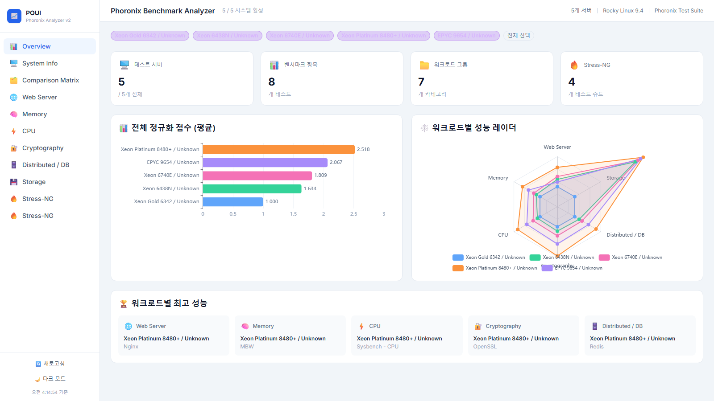
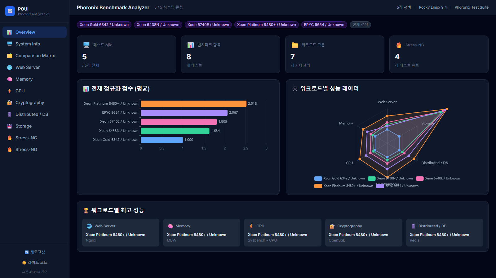
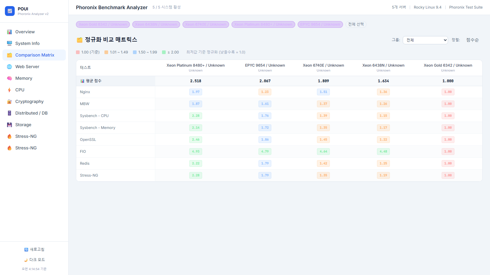
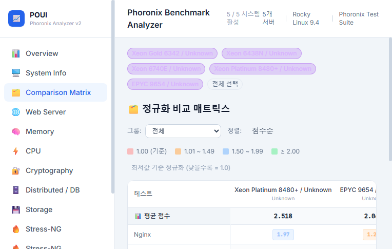

# 📊 서버 벤치마크 결과 분석 시스템 (POUI)

## 🎯 프로젝트 개요
약 500개 워크로드의 벤치마크 툴을 제공하는 툴킷.
필요한 워크로드를 선별하여 벤치마크 & 결과를 자동으로 파싱하고 시각화하는 웹 기반 분석 시스템

Phoronix Test Suite의 XML 결과를 처리하여 인터랙티브한 차트, 테이블, 비교 매트릭스를 제공합니다.

---

## 🖼️ UI 미리보기

### 라이트 모드 — 대시보드 (정규화 점수 바 차트 & 워크로드별 레이더 차트)


### 다크 모드 — 대시보드


### 라이트 모드 — 정규화 비교 매트릭스


### 다크 모드 — 정규화 비교 매트릭스


> 사이드바 하단 **☀️ / 🌙 버튼**으로 라이트/다크 모드 전환 (기본값: 라이트 모드, localStorage 저장)

---

## 📁 프로젝트 구조
```
├── frontend/                   # React + TypeScript SPA
│   ├── src/
│   │   ├── components/         # Dashboard, BenchmarkSection, ComparisonMatrix, StressNGSection 등
│   │   ├── hooks/              # SWR 기반 데이터 페칭, 테마 관리
│   │   ├── types/              # TypeScript 인터페이스
│   │   ├── lib/                # 유틸리티 함수 (정규화, 포맷팅, 차트 테마 등)
│   │   └── data/               # Stress-NG 가이드 데이터 (52개 테스트 정의)
│   ├── tailwind.config.js
│   └── vite.config.ts
├── backend/                    # Node.js Express API 서버
│   └── src/
│       ├── server.js           # REST API + SPA 서빙
│       └── benchmarkParser.js  # XML 파싱 엔진
├── results/                    # 벤치마크 결과 데이터 (Docker 볼륨 마운트)
│   ├── stress-ng03/
│   ├── nginx03/
│   │   ├── composite.xml       # 테스트 결과 종합요약
│   │   ├── test-logs/          # 벤치마크 상세 결과
│   │   └── system-logs/        # hostname, dmesg, meminfo 등
│   └── ..
├── Dockerfile                  # 멀티스테이지 빌드 (frontend + backend)
├── docker-compose.yml
└── dev.sh                      # 로컬 개발 실행 스크립트
```

## 📁 벤치마크 workload List
```
┌─ Nginx
├─ Apache HTTP
├─ Apache Hadoop
├─ Sysbench (CPU / Memory)
├─ MBW (Memory)
├─ Stress-NG (다양한 CPU/Memory 등 연산·성능, 52개 테스트)
├─ etcd
├─ OpenSSL
├─ IOR (Disk IO)
└─ .. (추후 추가)
```

---

## 🚀 핵심 기능

- **자동 데이터 파싱**: PTS XML 결과를 자동으로 분석하여 구조화된 데이터로 변환
- **인터랙티브 시각화**: ECharts 기반 바 차트, 레이더 차트, 히트맵
- **성능 비교 매트릭스**: 시스템 간 정규화 점수 히트맵 (색상 티어 시스템)
- **Stress-NG 심화 분석**: 52개 테스트를 5개 그룹으로 자동 분류 + 가이드 모달
- **시스템 정보 패널**: CPU, 메모리, 디스크, OS, 커널, 컴파일러 등 하드웨어 스펙 카드
- **동적 시스템 필터**: 비교 대상을 토글 pill로 즉시 전환
- **실시간 데이터 갱신**: `/api/refresh` 엔드포인트로 파싱 결과 즉시 업데이트
- **라이트/다크 테마**: 사이드바 토글로 전환, 기본값 라이트 모드, localStorage 저장

---

## 🛠 기술 스택

| 영역 | 기술 |
|------|------|
| Frontend | React 18, TypeScript 5, Vite, Tailwind CSS |
| 차트 | ECharts 5 (echarts-for-react) |
| 데이터 페칭 | SWR |
| Backend | Node.js 20, Express 4 |
| XML 파싱 | fast-xml-parser 5 |
| 컨테이너 | Docker (멀티스테이지 빌드), Docker Compose |

---

## 🚢 실행 방법

### 프로덕션 (Docker)
```bash
docker compose up -d
# http://localhost:3000
```

### 개발 모드
```bash
bash dev.sh
# backend: http://localhost:3001
# frontend: http://localhost:5173 (Vite HMR)
```

`results/` 디렉토리에 PTS XML 결과를 넣으면 자동으로 파싱됩니다.

---

## 🔌 API 엔드포인트

| 엔드포인트 | 메서드 | 설명 |
|-----------|--------|------|
| `/api/health` | GET | 서버 상태, 캐시 정보 |
| `/api/data` | GET | 전체 벤치마크 데이터 (파싱 결과) |
| `/api/refresh` | POST | 캐시 초기화 + 재파싱 |
| `/api/systems` | GET | 시스템 목록 + 스펙 |

---

## 💡 핵심 알고리즘

### 성능 정규화
```javascript
// 최저 성능을 1.0 기준으로 하는 상대적 성능 계산
const normalizedScore = isLatencyTest
    ? (worstValue / currentValue)   // 낮을수록 좋은 지표 (latency)
    : (currentValue / worstValue);  // 높을수록 좋은 지표 (throughput)
```

### 동적 단위 변환
```javascript
function formatValue(value, unit) {
    if (value >= 1e9) return { value: (value/1e9).toFixed(2), unit: 'G' + unit };
    if (value >= 1e6) return { value: (value/1e6).toFixed(2), unit: 'M' + unit };
    if (value >= 1e3) return { value: (value/1e3).toFixed(2), unit: 'K' + unit };
    return { value: value.toFixed(2), unit };
}
```

### 메모리 정보 자동 보정
```javascript
// DIMM 개수와 용량을 meminfo에서 자동 추출하여 "16 x 16 GB" 형태로 정규화
function normalizeMemoryString(memoryStr, logsDir) {
    // meminfo 파일에서 총 메모리 용량을 읽어 개별 DIMM 크기 추정
    // 서버급 DIMM 크기 후보군과 매칭하여 정확한 구성 정보 생성
}
```

---

## 📈 주요 성과

- **데이터 일원화**: 복잡하고 산재된 벤치마크 데이터를 단일 대시보드로 시각화
- **표준화된 벤치마킹**: 매번 일관된 옵션으로 Test-suite 수행
- **동적 비교**: 필터/검색으로 비교 대상을 즉시 전환
- **확장 가능한 파서**: 새로운 워크로드를 쉽게 추가할 수 있는 모듈형 구조

---

## 🗺️ 향후 발전 계획

상세 로드맵은 [ROADMAP.md](ROADMAP.md)를 참고하세요.

| 버전 | 핵심 목표 |
|------|-----------|
| v1.1 | Redis, PostgreSQL 등 워크로드 추가, PDF 내보내기 |
| v1.2 | **전력 데이터 수집/시각화** — IPMI/BMC 기반 소비전력 연동 및 워크로드별 전력 효율 분석 |
| v1.3 | **시스템 검수 표준화** — 벤치마크 결과를 검수 기준값과 비교하여 Pass/Fail 판정 및 표준 리포트 생성 |
| v2.0 | 백엔드 DB 연동, 히스토리 관리, WebSocket 실시간 모니터링 |
| v2.5 | ML 기반 이상 탐지 및 성능 예측 |
| v3.0 | 클라우드 플랫폼 (AWS/Azure/GCP) |

---

*이 프로젝트는 실제 엔터프라이즈 환경에서 서버 성능 분석에 활용되고 있으며, 지속적인 개선과 확장이 진행되고 있습니다.*
